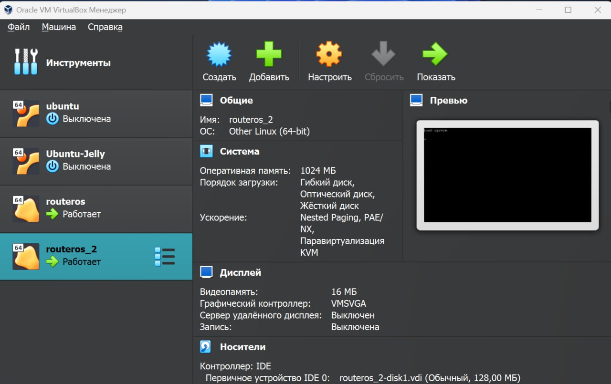
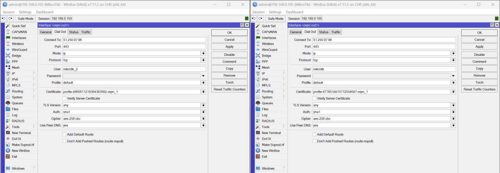
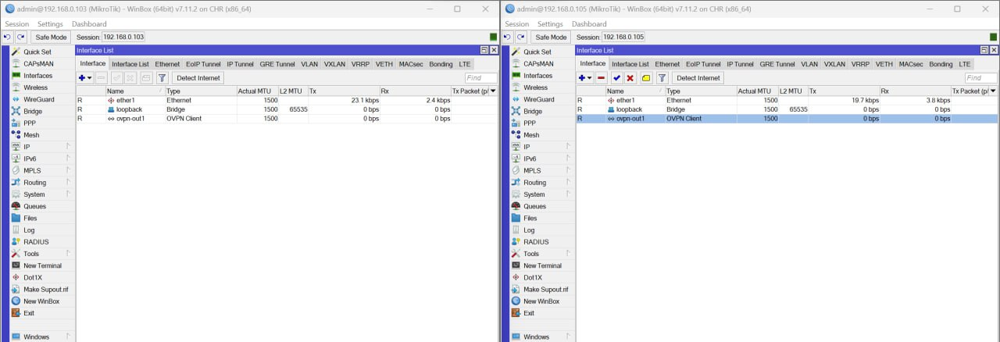
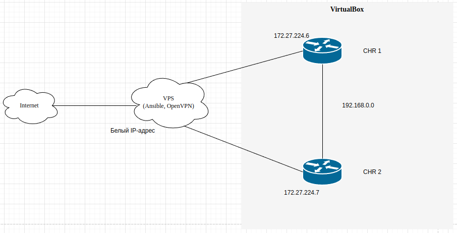
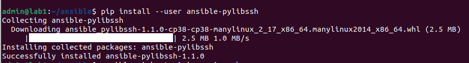
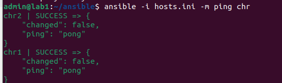
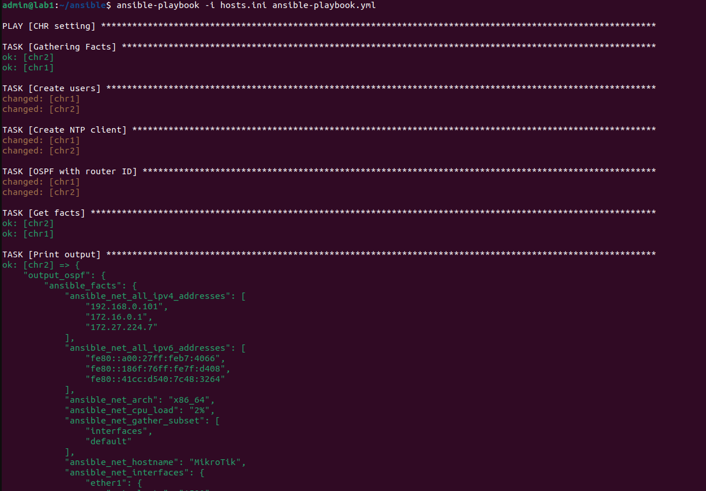
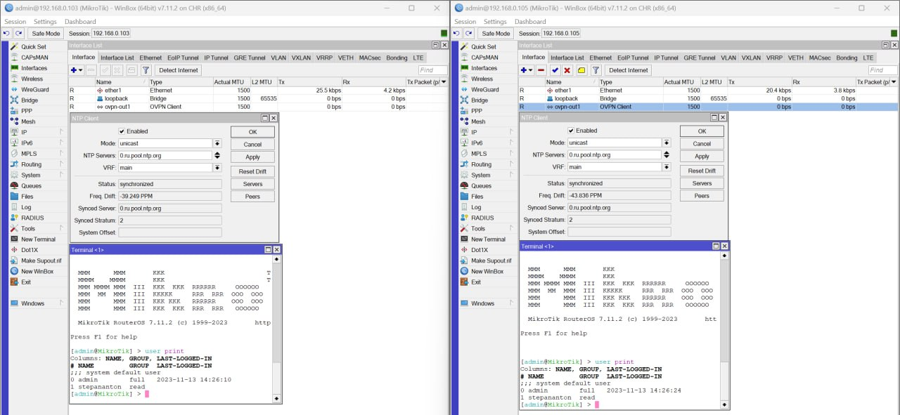
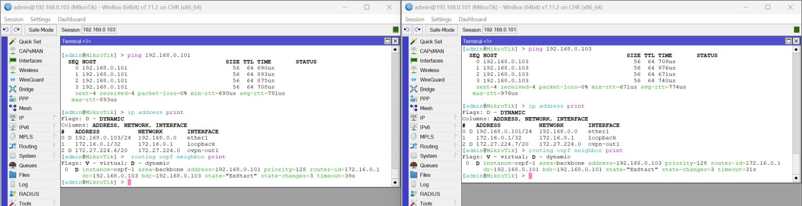

#### University: [ITMO University](https://itmo.ru/ru/)
##### Faculty: [FICT](https://fict.itmo.ru)
##### Course: [Network Programming](https://itmo-ict-faculty.github.io/network-programming/)

Group: K34202

Author: Tikhonov Stepan Nikolaevich

Lab: Lab2

Date of create: 2.11.23

Date of finished: 13.11.23

## Отчёт по лабораторной работе №2 "Развертывание дополнительного CHR, первый сценарий Ansible"

**Цель работы:** С помощью вм с Ansible настроить 2 роутера Mikrotik и собрать информацию о них. Правильно собрать файл Inventory.

**Ход работы:**

### 1. Установка второго CHR на хост

Используя Virtualbox склонируем созданную в прошлой работе вм с новыми настройками, а затем подключим ее к OpenVPN серверу.



### 2. Настройка OVPN Client на втором CHR




### 3. Схема связи



### 4. Настройка CHR при помощи Ansible

Ansible был установлен еще в 1 ЛР, но для работы необходимо установить библиотеку для работы по SSH.



Для настройки конфигураций были созданы 2 файла:
- Файл инвентаря [hosts.ini](./hosts.ini), в котором указаны данные об устройствах для настройки.

Тестирование подключения через файл инвентаря при помощи ad-hoc команды ping



- [Ansible-playbook](./ansible-playbook.yml) файл с командами для настройки конфигурации:
```
---
- name:  CHR setting
  hosts: chr
  tasks:
    - name: Create users
      routeros_command:
        commands: 
          - /user add name=stepananton group=read password=stepananton

    - name: Create NTP client
      routeros_command:
        commands:
          - /system ntp client set enabled=yes server=0.ru.pool.ntp.org
        
    - name: OSPF with router ID
      routeros_command:
        commands: 
          #- /ip address add address=10.10.10.1/30 interface=ether3 network=10.10.10.0
          - /interface bridge add name=loopback
          - /ip address add address=172.16.0.1 interface=loopback network=172.16.0.1
          - /routing id add disabled=no id=172.16.0.1 name=OSPF_ID select-dynamic-id=""
          - /routing ospf instance add name=ospf-1 originate-default=always router-id=OSPF_ID
          - /routing ospf area add instance=ospf-1 name=backbone
          - /routing ospf interface-template add area=backbone auth=md5 auth-key=admin interface=ether1

    - name: Get facts
      routeros_facts:
        gather_subset:
          - interfaces
      register: output_ospf

    - name: Print output
      debug:
        var: "output_ospf"
```

Запускаем выполнение ansible-playbook при помощи команды:
```
ansible-playbook -i hosts.ini ansible-playbook.yml
```
Результат выполнения плейбука.


Результат сбора фактов после выполнения ansible-playbook для каждой из машин представлен в файлах:
- [CHR 1 output](./output_chr1.txt)
- [CHR 2 output](./output_chr2.txt)

### 5. Проверка конфигурации

Созданные на машинах пользователи и NTP Clients:



Проверка связности вм и OSPF на них.



Полная конфигурация устройств представлен в файлах:

- [CHR 1 config](./exp1.rsc)
- [CHR 2 config](./exp2.rsc)


## Вывод:
В результате выполнения работы, с помощью Ansible, были настроены несколько сетевых устройств, создан файл Inventory, и собрана информацию о настроеных устройствах.