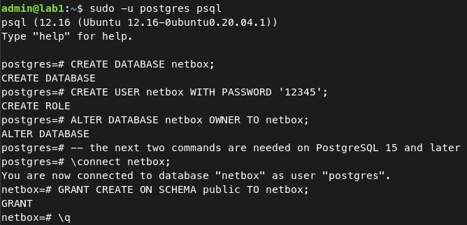
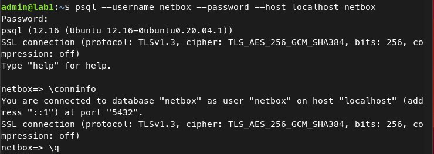
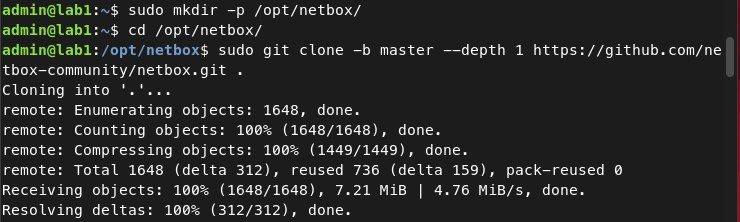
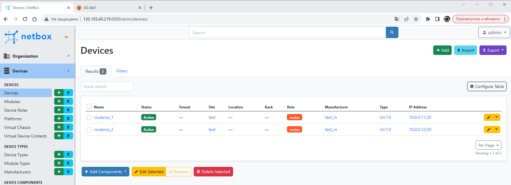
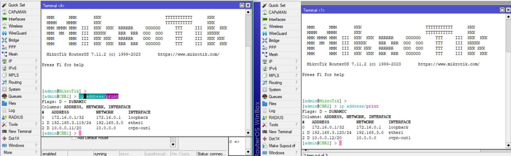
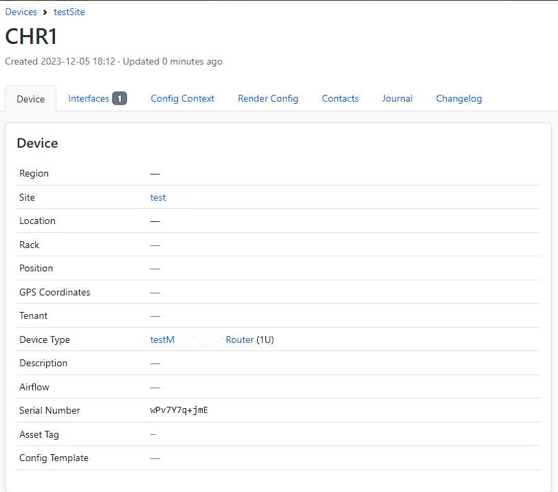
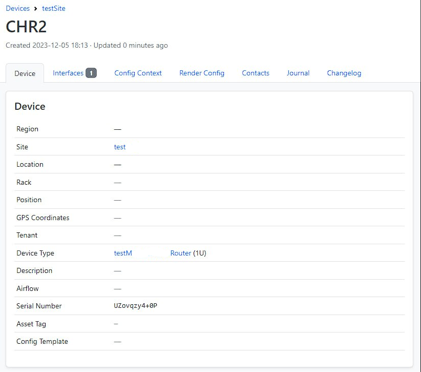
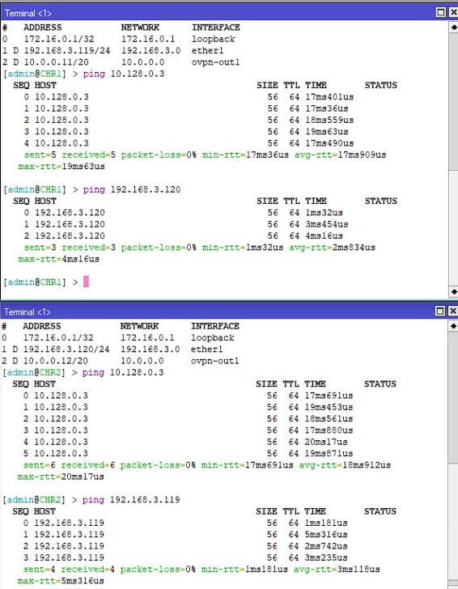

#### University: [ITMO University](https://itmo.ru/ru/)
##### Faculty: [FICT](https://fict.itmo.ru)
##### Course: [Network Programming](https://itmo-ict-faculty.github.io/network-programming/)

Group: K34202

Author: Tikhonov Stepan Nikolaevich

Lab: Lab3

Date of create: 29.11.23

Date of finished: 6.12.23

## Отчёт по лабораторной работе №3 "Развертывание Netbox, сеть связи как источник правды в системе технического учета Netbox"

**Цель работы:** С помощью Ansible и Netbox собрать всю возможную информацию об устройствах и сохранить в отдельном файле.

**Ход работы:**

### 1. Подготовка удаленной ВМ и поднятие NetBox.

Поднимать NetBox необходимо на той же вм YandexCloud, что использовалась в предыдущих лабораторных. На ней уже установлен `python3` и `Ansible`, тем не менее в отчете показан весь процесс подготовки вм и установки NetBox.
Перед выполнением работы изменим настройки OpenVPN и сделаем статические адреса для роутеров.
Прежде всего установим PostgreSql:
```
sudo apt update
sudo apt install -y postgresql
```
Теперь установим Redis:
```
sudo apt install -y redis-server
```
Установим Python и необходимые для работы библиотеки:
```
sudo apt install -y python3 python3-pip python3-venv python3-dev build-essential libxml2-dev libxslt1-dev libffi-dev libpq-dev libssl-dev zlib1g-dev
```
Затем необходимо создать БД:
```
sudo -u postgres psql
```
После этого выполним следующие команды:



Проверим базу данных:



Теперь установим git и склонируем репозиторий NetBox:
```
sudo apt install -y git
```



Перейдем в каталог конфигурации NetBox и создаим копию configuration_example.py с именем configuration.py, который будет содержать все локальные параметры конфигурации.
```
cd /opt/netbox/netbox/netbox/
sudo cp configuration_example.py configuration.py
```

Затем исправим файл [configuration.py](./configuration.py). Изменим следующие параметры:
1. 
```
ALLOWED_HOSTS = ['*']
```
2. 
```
DATABASE = {
    'NAME': 'netbox',               # Database name
    'USER': 'netbox',               # PostgreSQL username
    'PASSWORD': '12345',            # PostgreSQL password
    'HOST': 'localhost',            # Database server
    'PORT': '',                     # Database port (leave blank for default)
    'CONN_MAX_AGE': 300,            # Max database connection age (seconds)
}
```
3. 
```
SECRET_KEY = 'p)MZI$MGn@sKrTX8=mRu@iX1faZ4Ga6aC-c#Pg6QXu+ycA5D#Z'
```

Секретный ключ заренее был сгенерирован с помощью:
```
python3 ../generate_secret_key.py
```

После изменения конфигурации запускаем сценарий обновелния:
```
sudo /opt/netbox/upgrade.sh
```

Теперь создаем суперпользователя (имя оставляем по умолчанию admin):
```
source /opt/netbox/venv/bin/activate
cd /opt/netbox/netbox
python3 manage.py createsuperuser
```

Наконец запускаем NetBox и подключаемся к серверу через браузер, после чего заполняем всю необходимую информацию о роутерах:
```
python3 manage.py runserver 0.0.0.0:8000 --insecure
```



### 2. Сбор данных из NetBox с помощью Ansible

Установим ansible-galaxy для Netbox:
```
ansible-galaxy collection install netbox.netbox
```

Создадим файл [netbox_galaxy_conf.yml](./netbox_galaxy_conf.yml):
```
plugin: netbox.netbox.nb_inventory
api_endpoint: http://127.0.0.1:8000
token: # токен создаем на сервере NetBox по ссылке  http://130.193.40.219/:8000/user/api-tokens/ и вставляем сюда
validate_certs: True
config_context: False
interfaces: True
```

Сохраняем вывод скрипта в [netbox_inventory.yml](./netbox_inventory.yml) командой:
```
ansible-inventory -v --list -y -i netbox_conf_galaxy.yml > netbox_inventory.yml
```
В [файле](https://github.com/Sbitnev/2023_2024-network_programming-k34202-sbitnev_a_s/blob/main/lab3/files/netbox_inventory%20copy.yml) теперь находится информация об устройствах в YAML-формате. После некоторых изменений мы можем использовать данный файл в качестве инвентарного.

### 3. Создание сценария - на основе данных из Netbox необходимо настроить 2 CHR, изменить имя устройства, добавить IP адрес на устройство.
Для начала отредактируем [netbox_inventory.yml](./netbox_inventory.yml). Перенесём переменные необходимые для подключения к роутерам:
```
  vars:
    ansible_connection: ansible.netcommon.network_cli
    ansible_network_os: community.routeros.routeros
    ansible_user: admin
    ansible_ssh_pass: 12345
```
Затем напишем [playbook](./ansible-playbook.yml) для изменения имени устройства и добавления IP адреса:
```
- name: Setup Routers
  hosts: ungrouped
  tasks:
    - name: "Change names of devicies"
      community.routeros.command:
        commands:
          - /system identity set name="{{ interfaces[0].device.name }}"

    - name: "Change IP-address"
      community.routeros.command:
        commands:
          - /ip address add address="{{ interfaces[0].ip_addresses[0].address }}" interface="{{ interfaces[0].display }}"
```

После этого запустим playbook командой:
```
ansible-playbook -i inventory ansible-playbook.yml
```
После выполнения playbook на роутерах изменятся адреса и имена:



### 4. Сценарий, собирающий серийный номер устройства и вносящий его в Netbox.

Для выполнения задачи напишем еще один [playbook](./ansible-playbook_2.yml).
```
- name: Get Serial Numbers
  hosts: ungrouped
  tasks:

    - name: "Get Serial Number"
      community.routeros.command:
        commands:
          - /system license print
      register: license

    - name: "Get Name"
      community.routeros.command:
        commands:
          - /system identity print
      register: identity

    - name: Add Serial Number to Netbox
      netbox_device:
        netbox_url: http://127.0.0.1:8000
        netbox_token: 1ef9042ee515f716bdad25fe37e4ed531d38c097
        data:
          name: "{{ identity.stdout_lines[0][0].split()[1] }}"
          serial: "{{ license.stdout_lines[0][0].split()[1] }}"
```
После чего выполним его, как в предыдущем пункте:
```
ansible-playbook -i inventory ansible-playbook_2.yml
```

Результат выполнения playbook на Netbox сервере:




Проверка связанности роутеров:



## Вывод:
В результате выполнения работы, с помощью Ansible, были настроены 2 роутера, создан файл inventory, и собрана информацию о настроенных роутерах.