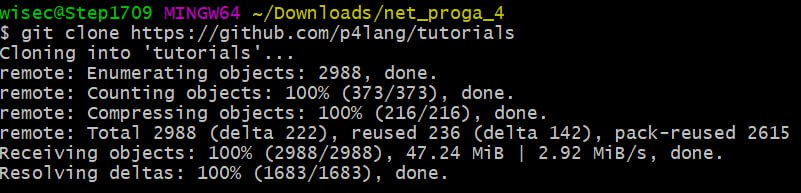
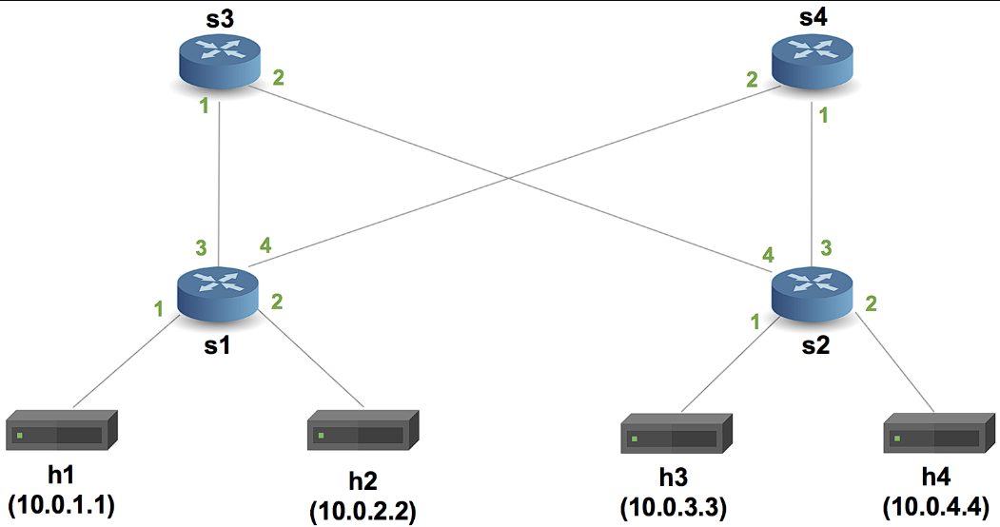
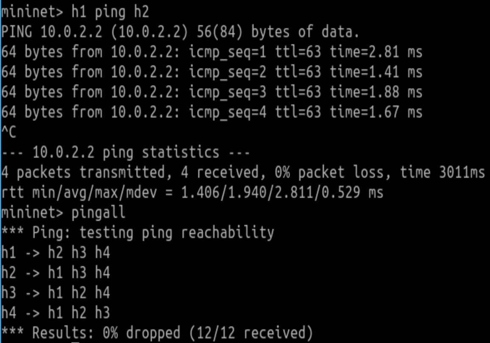
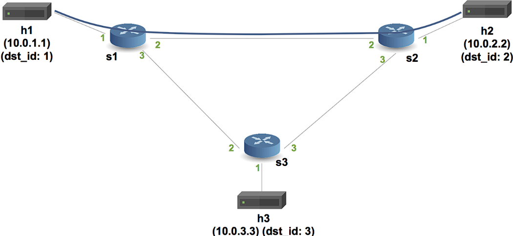
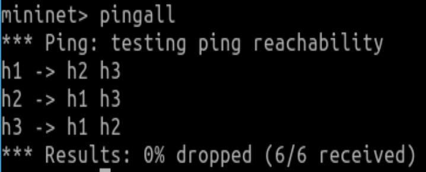
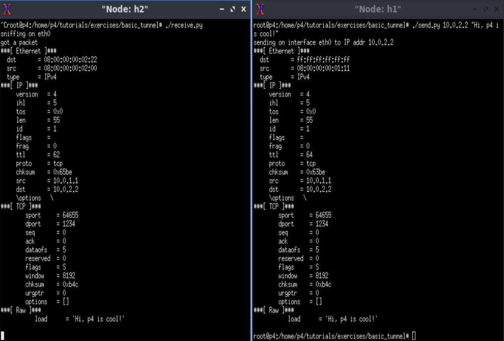
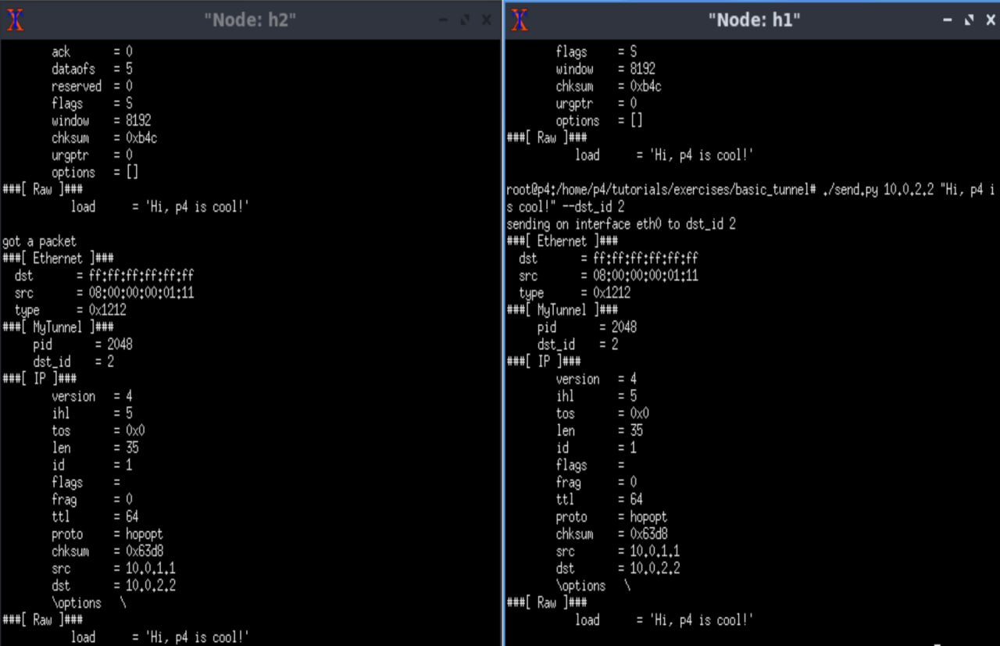

##### University: [ITMO University](https://itmo.ru/ru/)
##### Faculty: [FICT](https://fict.itmo.ru)
##### Course: [Network programming](https://itmo-ict-faculty.github.io/network-programming/)
##### Year: 2023/2024
##### Group: K34202
##### Author: Tikhonov Stepan
##### Lab: Lab4
##### Date of create: 06.12.2023
##### Date of finished: 07.12.2023

***

# Отчёт по лабораторной работе №4 "Базовая 'коммутация' и туннелирование используя язык программирования P4"


## **Цель работы:** 
Изучить синтаксис языка программирования P4 и выполнить 2 обучающих задания от Open network foundation для ознакомления на практике с P4.

## **Ход работы:**

### 1. Подготвка к выполнению работы.
Так как git bash и Vagrant у меня уже были установлены-пропустим шаги с их установкой.
Склонируем репозиторий в подготовленную папку [p4lang/tutorials](https://github.com/p4lang/tutorials)
```
sudo git clone https://github.com/p4lang/tutorials
```



Перейдем в папку cd vm-ubuntu-20.04 и запустим команду `vagrant up`после чего у нас скачается и установится вм.
В результате установки у нас появится виртуальная машина с аккаунтами login/password vagrant/vagrant и p4/p4.


### 2. Basic Forwarding.
#### Шаг 1. Исправим код p4.
В данном упражнении нужно дополнить скрипт basic.p4 так, чтобы в сети заработала переадресация IP-пакетов.
Схема связи сохдаваемой сети:


Файл basic.p4 содержит заготовку программы P4, в которой ключевые элементы логики заменены комментариями TODO.
Исправим код, добавив в парсер парсеры для Ethernet и IPv4, заполняющие поля ethernet_t и ipv4_t.
```
parser MyParser(packet_in packet,
                out headers hdr,
                inout metadata meta,
                inout standard_metadata_t standard_metadata) {

    state start { transition parse; }

    state parse{
      packet.extract(hdr.ethernet);
      transition select(hdr.ethernet.etherType) {
        TYPE_IPV4: parse_ipv4;
        default: accept;
        }
    }
      
    state parse_ipv4{
      packet.extract(hdr.ipv4);
      transition accept;
    }
}
```

Напишем  ipv4_forward, который:
* Устанавливает порт выхода для следующего узла.
* Обновляет MAC-адрес назначения Ethernet на адрес следующего узла.
* Обновляет MAC-адрес источника Ethernet на адрес коммутатора.
* Уменьшает значение TTL.

Добавим таблицу маршрутизации и условие проверки заголовка IPv4.

```
control MyIngress(inout headers hdr,
                  inout metadata meta,
                  inout standard_metadata_t standard_metadata) {
    action drop() {
        mark_to_drop(standard_metadata);
    }

    action ipv4_forward(macAddr_t dstAddr, egressSpec_t port) {
        standard_metadata.egress_spec= port; // Изменяем порт
        hdr.ethernet.srcAddr = hdr.ethernet.dstAddr; // Меняем адрес источника на свой
        hdr.ethernet.dstAddr = dstAddr; // Устанавливаем нового получателя
        hdr.ipv4.ttl = hdr.ipv4.ttl - 1; // Декрементируем TTL
    }

    table ipv4_lpm {
        key = {
            hdr.ipv4.dstAddr: lpm; // ключ таблицы
        }
        actions = {       // возможные действия
            ipv4_forward; 
            drop;
            NoAction;
        }
        size = 1024;    // размер таблицы
        default_action = NoAction(); // действие по умолчанию
    }

    apply {
        if(hdr.ipv4.isValid()){ // Недостающая часть (проверка)
          ipv4_lpm.apply();
        }
    }
```

Напишем депарсер, который выбирает порядок вставки полей в исходящий пакет.
```
control MyDeparser(packet_out packet, in headers hdr) {
    apply {
        packet.emit(hdr.ethernet);
        packet.emit(hdr.ipv4);
    }
}
```

#### Шаг 2. Запустим исправленный код.
Зайдем в созданную виртуальную машину под учетной записью p4/p4. Перейдем в каталог tutorials/exercices/basic.
Поднимем виртуальную сеть Mininet и скомпилируем [basic.p4](./basic.p4) командой:

```
make run
```

Теперь попробуем пропинговать хосты:



Ping удался.

### 2. Basic Tunneling.
В этом упражнении нужно реализовать туннелирование. Должна получиться такая сеть:



#### Шаг 1: Исправление кода p4.
Дополним скрипт, добавив в него новый заголовок, таблицу, несколько проверок на валидность, а также дополним парсер/депарсер, 
чтобы они обрабатывали дополнительный заголовок.
Перейдем в папку basic_tunnel
Файл [basic_tunnel.p4](./basic_tinnel.p4) содержит реализацию базового IP-маршрутизатора. Он также содержит комментарии, помеченные как TODO, 
которые указывают на функциональность, которую вам нужно реализовать.
Полная реализация коммутатора basic_tunnel.p4 сможет пересылать пакеты на основе содержимого пользовательского заголовка инкапсуляции,
а также выполнять обычную IP-пересылку, если заголовок инкапсуляции отсутствует в пакете.
Обработка заголовка парсером:
```
// TODO: Update the parser to parse the myTunnel header as well
parser MyParser(packet_in packet,
                out headers hdr,
                inout metadata meta,
                inout standard_metadata_t standard_metadata) {

    state start {
        transition parse_ethernet;
    }

    state parse_ethernet {
        packet.extract(hdr.ethernet);
        transition select(hdr.ethernet.etherType) {
            TYPE_MYTUNNEL: parse_myTunnel;
            TYPE_IPV4: parse_ipv4;
            default: accept;
        }
    }

    state parse_myTunnel {
        packet.extract(hdr.myTunnel);
        transition select(hdr.myTunnel.proto_id) {
            TYPE_IPV4: parse_ipv4;
            default: accept;
        }
    }

    state parse_ipv4 {
        packet.extract(hdr.ipv4);
        transition accept;
    }

}
```

Создадим новое действие с именем myTunnel_forward, которое устанавливает порт выхода. 
Добавим таблицу, аналогичную ipv4_lpm, но переадресацию заменяем на туннельную. 
Обновим блок apply в блоке управления MyIngress, чтобы применить вновь определенную таблицу myTunnel_exact:
```
control MyIngress(inout headers hdr,
                  inout metadata meta,
                  inout standard_metadata_t standard_metadata) {
    action drop() {
        mark_to_drop(standard_metadata);
    }

    action ipv4_forward(macAddr_t dstAddr, egressSpec_t port) {
        standard_metadata.egress_spec = port;
        hdr.ethernet.srcAddr = hdr.ethernet.dstAddr;
        hdr.ethernet.dstAddr = dstAddr;
        hdr.ipv4.ttl = hdr.ipv4.ttl - 1;
    }

    table ipv4_lpm {
        key = {
            hdr.ipv4.dstAddr: lpm;
        }
        actions = {
            ipv4_forward;
            drop;
            NoAction;
        }
        size = 1024;
        default_action = drop();
    }

    // TODO: declare a new action: myTunnel_forward(egressSpec_t port)
    action myTunnel_forward(egressSpec_t port) {
        standard_metadata.egress_spec = port;
    }

    // TODO: declare a new table: myTunnel_exact
    // TODO: also remember to add table entries!
    table myTunnel_exact {
        key = {
            hdr.myTunnel.dst_id: exact;
        }
        actions = {
            myTunnel_forward;
            drop;
        }
        size = 1024;
        default_action = drop();
    }

    apply {
        // TODO: Update control flow
        if (hdr.ipv4.isValid() && !hdr.myTunnel.isValid()) {
            ipv4_lpm.apply();
        }

        if (hdr.myTunnel.isValid()) {
            myTunnel_exact.apply();
        }
    }
}
```

Добавим новый заголовок в депарсер:
```
control MyDeparser(packet_out packet, in headers hdr) {
    apply {
        packet.emit(hdr.ethernet);
        // TODO: emit myTunnel header as well
        packet.emit(hdr.myTunnel); // Заголовок туннеля
        packet.emit(hdr.ipv4);
    }
}
```

#### Шаг 2: Запуск исправленного кода.
Запустим mininet аналогично предыдущему заданию.
Проверим связанность:



Теперь откроем два терминала для h1 и h2 командой:
```
xterm h1 h2
```
Сначала протестируем без туннелирования. В xterm h1 отправим сообщение на h2:



Пакет должен быть получен на h2. 
Изучив полученный пакет, можно увидеть, что он состоит из заголовка Ethernet, заголовка IP, заголовка TCP и сообщения. 
Если изменить IP-адрес назначения (например, попробуйте отправить на 10.0.3.3), то сообщение не будет получено h2, а вместо этого будет получено h3.

Теперь протестируем с туннелированием: 



В xterm h1 отправим сообщение с id 2, но ip от h3:


Пакет пришел на h2, хотя IP-адрес является адресом h3. 
Это происходит потому, что коммутатор больше не использует IP-заголовок для маршрутизации, когда в пакете присутствует заголовок MyTunnel.

## **Вывод:** 
В результате выполнения работы был изучен синтаксис языка программирования P4 и выполнены 2  задания от Open network foundation для ознакомления с P4.